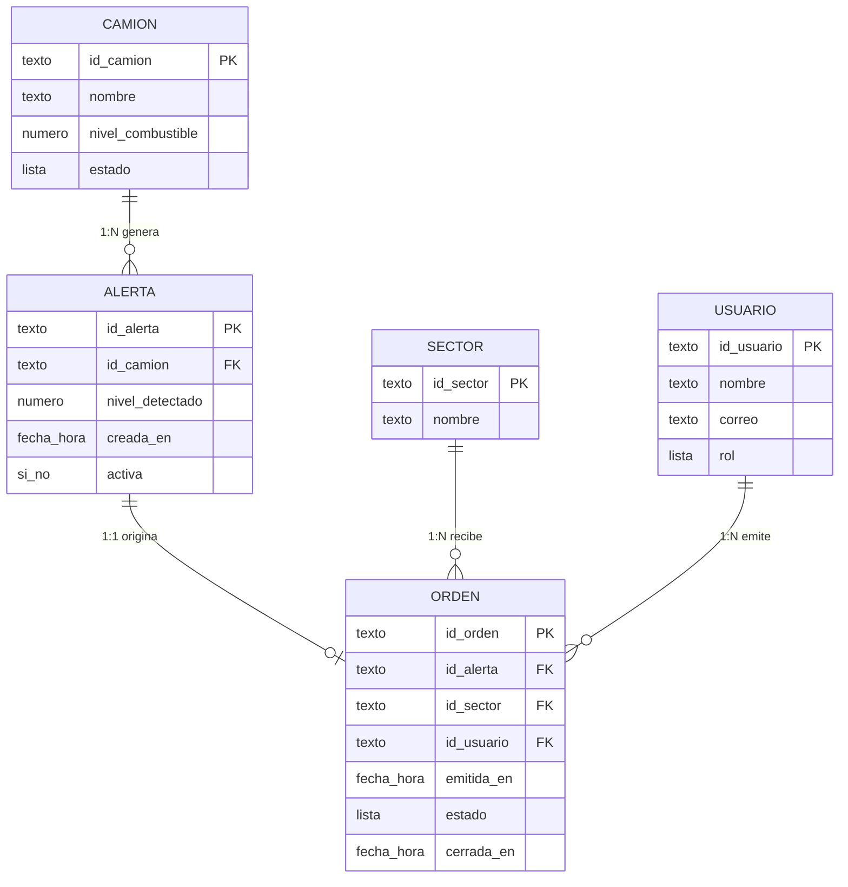

# Estructura de datos

## 1. Diagrama de la base de datos

Listas de valores:
- CAMION.estado: normal, alerta, critico, sin_senal, en_proceso, abastecido
- USUARIO.rol: controlador, supervisor
- ORDEN.estado: emitida, en_proceso, cerrada

## 2. Campos obligatorios y ejemplos

`*` = obligatorio (no puede quedar vacío).

### CAMION
| id_camion* | nombre* | nivel_combustible* | estado* |
|---|---|---|---|
| CAM-07 | Camión 07 | 12 | critico |
| CAM-19 | Camión 19 | 18 | critico |

### SECTOR
| id_sector* | nombre* |
|---|---|
| SEC-B | Sector B |
| SEC-A | Sector A |

### USUARIO
| id_usuario* | nombre* | correo* | rol* |
|---|---|---|---|
| USR-01 | Controlador Turno A | controlador.a@ejemplo.cl | controlador |
| USR-02 | Supervisor Turno A | supervisor.a@ejemplo.cl | supervisor |

### ALERTA
| id_alerta* | id_camion* | nivel_detectado* | creada_en* | activa* |
|---|---|---|---|---|
| ALR-001 | CAM-07 | 12 | 2026-10-01 09:42 | sí |
| ALR-002 | CAM-19 | 18 | 2026-10-01 09:44 | sí |

### ORDEN
`cerrada_en` es opcional: queda vacío hasta que se cierra el reabastecimiento.

| id_orden* | id_alerta* | id_sector* | id_usuario* | emitida_en* | estado* | cerrada_en |
|---|---|---|---|---|---|---|
| ORD-001 | ALR-001 | SEC-B | USR-01 | 2026-10-01 09:45 | cerrada | 2026-10-01 10:05 |
| ORD-002 | ALR-002 | SEC-A | USR-01 | 2026-10-01 09:48 | en_proceso | |